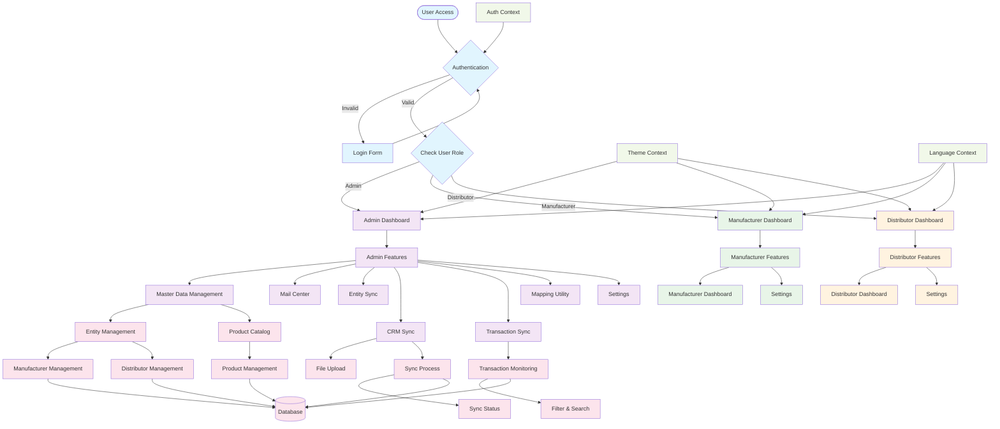
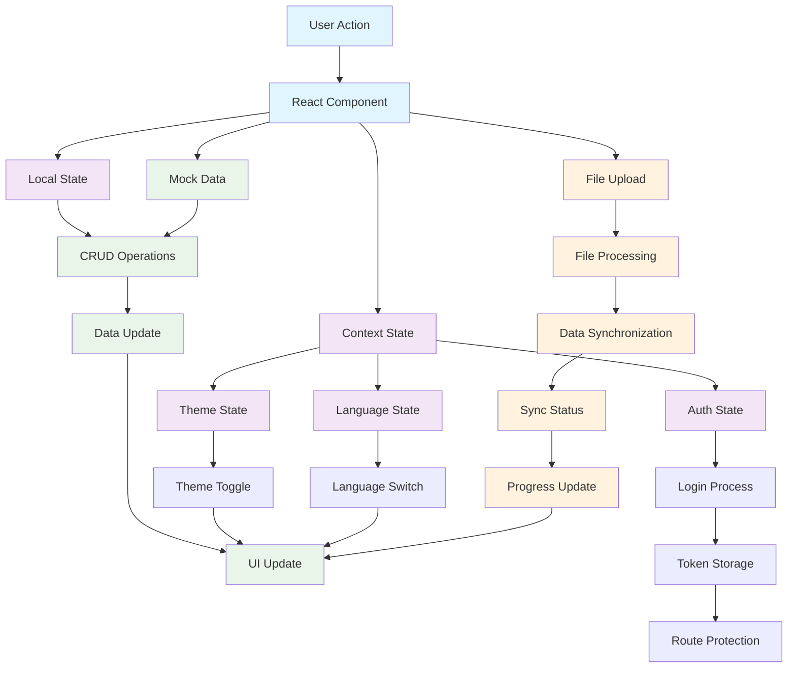
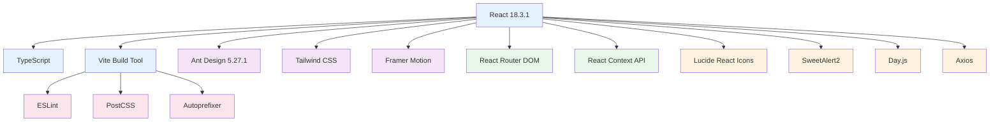

# DMS (Document Management System) - Flow Diagram

## System Architecture & User Flow



## Component Architecture

```mermaid
graph TB
    %% Main App Structure
    App[App.tsx] --> Router[React Router]
    App --> Providers[Context Providers]
    
    %% Context Providers
    Providers --> ThemeProvider[Theme Provider]
    Providers --> LanguageProvider[Language Provider]
    Providers --> AuthProvider[Auth Provider]
    
    %% Layout Components
    Router --> Layout[Layout Component]
    Layout --> Header[Header Component]
    Layout --> Sidebar[Sidebar Component]
    Layout --> MainContent[Main Content Area]
    
    %% Authentication
    AuthProvider --> LoginForm[Login Form]
    AuthProvider --> AuthState[Authentication State]
    
    %% Page Components
    MainContent --> Dashboard[Dashboard Page]
    MainContent --> Masters[Masters Page]
    MainContent --> MailCenter[Mail Center Page]
    MainContent --> CRMSync[CRM Sync Page]
    MainContent --> TransSync[Transaction Sync Page]
    MainContent --> Mapping[Mapping Utility Page]
    MainContent --> Settings[Settings Page]
    
    %% Dashboard Components
    Dashboard --> MfrDashboard[Manufacturer Dashboard]
    Dashboard --> DistDashboard[Distributor Dashboard]
    Dashboard --> AdminDashboard[Admin Dashboard]
    
    %% Masters Components
    Masters --> EntityManagement[Entity Management]
    Masters --> ProductManagement[Product Management]
    EntityManagement --> MfrTable[Manufacturer Table]
    EntityManagement --> DistTable[Distributor Table]
    ProductManagement --> ProductTable[Product Table]
    
    %% Sync Components
    CRMSync --> FileUpload[File Upload Component]
    CRMSync --> SyncProgress[Sync Progress]
    CRMSync --> ActivityTimeline[Activity Timeline]
    
    TransSync --> TransTable[Transaction Table]
    TransSync --> FilterControls[Filter Controls]
    
    %% Styling
    classDef mainApp fill:#e3f2fd
    classDef providers fill:#f3e5f5
    classDef layout fill:#e8f5e8
    classDef pages fill:#fff3e0
    classDef components fill:#fce4ec
    
    class App,Router mainApp
    class ThemeProvider,LanguageProvider,AuthProvider providers
    class Layout,Header,Sidebar,MainContent layout
    class Dashboard,Masters,MailCenter,CRMSync,TransSync,Mapping,Settings pages
    class LoginForm,AuthState,MfrDashboard,DistDashboard,AdminDashboard,EntityManagement,ProductManagement,MfrTable,DistTable,ProductTable,FileUpload,SyncProgress,ActivityTimeline,TransTable,FilterControls components
```



## Data Flow & State Management



## Technology Stack & Dependencies



## Key Features & Functionality

### 1. **Authentication & Authorization**
- Role-based access control (Admin, Manufacturer, Distributor)
- Mock authentication with localStorage persistence
- Protected routes and navigation

### 2. **Dashboard System**
- Role-specific dashboards with relevant metrics
- Real-time statistics and KPIs
- Interactive charts and progress indicators

### 3. **Master Data Management**
- Manufacturer and Distributor entity management
- Product catalog management
- CRUD operations with form validation
- Advanced filtering and search capabilities

### 4. **Synchronization Features**
- CRM data synchronization
- Transaction sync monitoring
- File upload and processing
- Real-time sync status tracking

### 5. **Multi-language Support**
- Hindi and English language support
- Context-based translation system
- Dynamic language switching

### 6. **Theme Management**
- Dark/Light theme support
- Dynamic theme switching
- Consistent color schemes across components

### 7. **Responsive Design**
- Mobile-first approach
- Adaptive layouts for different screen sizes
- Touch-friendly interface elements

## User Roles & Permissions

| Role | Dashboard Access | Masters | Mail Center | Entity Sync | CRM Sync | Transaction Sync | Mapping | Settings |
|------|------------------|---------|-------------|-------------|----------|------------------|---------|----------|
| **Admin** | ✅ Full Access | ✅ Full Access | ✅ Full Access | ✅ Full Access | ✅ Full Access | ✅ Full Access | ✅ Full Access | ✅ Full Access |
| **Manufacturer** | ✅ Limited | ❌ No Access | ❌ No Access | ❌ No Access | ❌ No Access | ❌ No Access | ❌ No Access | ✅ Limited |
| **Distributor** | ✅ Limited | ❌ No Access | ❌ No Access | ❌ No Access | ❌ No Access | ❌ No Access | ❌ No Access | ✅ Limited |

## File Structure Overview

```
DMS-Frontend/
├── src/
│   ├── components/          # Reusable UI components
│   │   ├── Auth/           # Authentication components
│   │   └── Layout/         # Layout components (Header, Sidebar)
│   ├── contexts/           # React Context providers
│   │   ├── AuthContext.tsx # Authentication state
│   │   ├── ThemeContext.tsx # Theme management
│   │   └── LanguageContext.tsx # Internationalization
│   ├── pages/              # Main application pages
│   │   ├── Dashboard.tsx   # Role-based dashboards
│   │   ├── Masters.tsx     # Master data management
│   │   ├── CRMSync.tsx     # CRM synchronization
│   │   ├── TransactionSync.tsx # Transaction monitoring
│   │   └── ...             # Other pages
│   ├── types/              # TypeScript type definitions
│   └── App.tsx             # Main application component
├── package.json            # Dependencies and scripts
└── vite.config.ts          # Build configuration
```

This DMS system provides a comprehensive solution for managing FMCG distribution networks with role-based access, real-time synchronization, and modern UI/UX design patterns.
